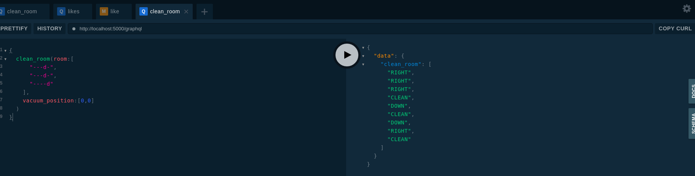

## Motivation

The goal of this workshop is to implement the firmware of our new robot vacuum, ``Stack-BlackHole``.


The system is specifically design to be control through a remote platform that will give
back instruction to the robot about action to perform on the room and reduce by this limit the impact
of the environment reducing the number of move to perform the best cleaning operation.

The robot communicate with the platform, ``Stack-Fleet`` through a graphql API.



```graphql
{
  clean_room(room:[
    	"---d-",
    	"---d-",
    	"----d"
    ],
    vacuum_position:[0,0]
  )
}
```

the answer from ``Stack-Fleet``

```json
{
  "data": {
    "clean_room": [
      "RIGHT",
      "RIGHT",
      "RIGHT",
      "CLEAN",
      "DOWN",
      "CLEAN",
      "DOWN",
      "RIGHT",
      "CLEAN"
    ]
  }
}
```

## Missions

1. implement the algorithm to solve the ``path search`` algorithm by implementing
the function ``next_dirty_cell``

2. design and implement automatic testing using ``unittest`` or ``pytest`` framework

3. discuss about software design evolution to implement alternative algorithm as plug-in

4. discuss about software design strategy to implement a fake server for frontend development

## Getting started

### System requirements

The following requirements has to be setup on your host before running the command
from this repository.

* `python 3.6` at least
* [pipenv](https://pipenv.pypa.io/en/latest/)

### Install the python dependencies

```bash
make install_requirements_dev
make start
```

## The latest version

You can find the latest version to ...

```bash
git clone git@github.com:Stackeo-io/workshop-stack-fleet-robot-vacuum.git
```

## Usage

You can run the application with the following command

```python
make start
```

### Usage for production

This blueprint use ``gunicorn`` as wsgi server for production configuration.
The command is set in the Procfile to be available on PaaS environment as ``Heroku`` or ``Scalingo``.

```bash
pipenv run prod
```

## Contributing

### Install development environment

Use make to instanciate a python virtual environment in ./venv3 and install the
python dependencies.

```bash
make install_requirements_dev
```

### Freeze the library requirements

If you want to freeze all the packages, use
this procedure

```bash
make update
```

### Activate the python environment

When you setup the requirements, a `venv3` directory on python 3 is created.
To activate the venv, you have to execute /

```bash
make activate
```

### Run the linter and the unit tests

Before commit or send a pull request, you have to execute pylint to check the syntax
of your code and run the unit tests to validate the behavior.

```bash
make lint
make tests
```

## Contributors

* Fabien Arcellier

## License

A short snippet describing the license (MIT, Apache, etc.)
